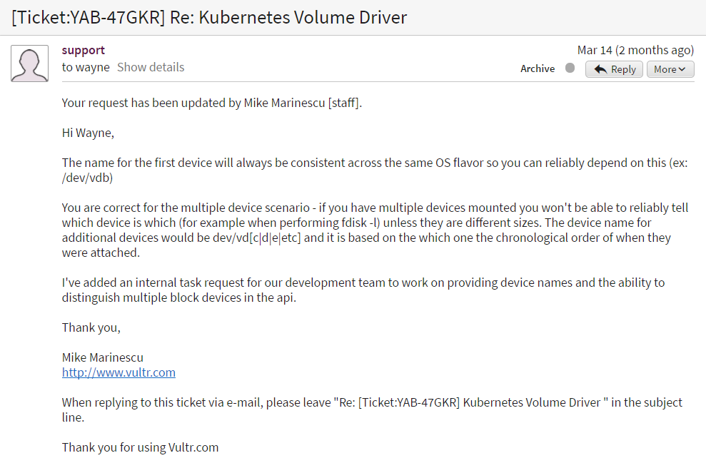

% Kubernetes Volumes
% Wayne Chang (wayne@wyc.io)
% May 24th, 2017

# Table of Contents

These slides _attempt_ to cover:

- Volume Terminology and Life Cycles
- Volume Plugin Codewalk
- Future of Volumes

<https://github.com/wyc/k8s-volumes>

glhf!

# Terminology, Demystified

- Volume
- PersistentVolume
- PersistentVolumeClaim
- StatefulSets (previously, PetSets pre-1.5)

# What Are `Volume`s?

**`Volume`s** are storage facilities tied to the lifetime of a Pod. They die
when the Pod dies. They are specified in a Pod definition. Think Docker
volumes.


# `Volume` example

```yaml
apiVersion: v1
kind: Pod
metadata:
  name: test-pd
spec:
  containers:
  - image: gcr.io/google_containers/test-webserver
    name: test-container
    volumeMounts:
    - mountPath: /test-pd
      name: test-volume
  volumes:
  - name: test-volume
    hostPath:
      # directory location on host
      path: /data
```


# What are `PersistentVolume`s?

**`PersistentVolume`s** are cluster-level networked storage resources that
exist on their own. They can be provisioned by an admin or on the fly.

They can be in one of many states:

- Provisioning
- Binding
- Using
- Releasing
- Reclaiming

# `PersistentVolume` Example

```yaml
apiVersion: "v1"
kind: "PersistentVolume"
metadata:
  name: "gce-disk-pv-1"
  annotations:
    volume.beta.kubernetes.io/mount-options: "discard"
spec:
  capacity:
    storage: "50Gi"
  accessModes:
    - "ReadWriteOnce"
  gcePersistentDisk:
    fsType: "ext4"
    pdName: "gce-disk-1
```

# What are `PersistentVolumeClaim`s?

**`PersistentVolumeClaim`s** are cluster-level metadata that exist on their
own. They are matched to a specific `PersistentVolume`, and then bound
exclusively to it.

The claims are then used by multiple `Pods` as `Volume`.

# `PersistentVolumeClaim` Example

```yaml
apiVersion: "v1"
kind: "PersistentVolumeClaim"
metadata:
  name: "gce-disk-pvc-1"
spec:
  accessModes:
    - "ReadWriteOnce"
  resources:
    requests:
      storage: "50Gi"
  storageClassName: "slow" -- pd-standard/pd-ssd
  selector:
    matchLabels:
      release: "stable"
    matchExpressions:
      - {key: environment, operator: In, values: [dev]}
```

# `PersistentVolumeClaim` as `Volume` Example

```yaml
kind: Pod
apiVersion: v1
metadata:
  name: mypod
spec:
  containers:
    - name: frontend
      image: dockerfile/nginx
      volumeMounts:
      - mountPath: "/var/www/html"
        name: www
  volumes:
    - name: www
      persistentVolumeClaim:
        claimName: gce-disk-pvc-1
```

# Killing `PersistentVolumeClaims`

```bash
$ kubectl delete pvc -l app=myapp
```

From the [docs](https://kubernetes.io/docs/tasks/run-application/delete-stateful-set/):

> You should never assume ability to access a volume after claim deletion.

Enter reclaim policies:
    - recycle
    - retain
    - delete
    
With retain, you are expected to either delete and recreate the PV or clear the
status block with the API manually.


# What are `StatefulSet`s?

``StatefulSets`` give the following guarantees:

- Ordered deployment, scaling, deletion, and termination
    - Who's on first? (Master Node, obvs.)
- Stable network identifiers (e.g., web-0, web-1) and **persistent storage** (?!?!)

# What?! Stable persistent storage?

Yes. It's true.

```go
// types.go:84
// The StatefulSet controller is responsible for mapping
// network identities to claims in a way that maintains
// the identity of a pod.
```


```go
// stateful_set_utils.go:94
func getPersistentVolumeClaimName(
    set *apps.StatefulSet,
    claim *v1.PersistentVolumeClaim,
    ordinal int
) string {
	return fmt.Sprintf(
        "%s-%s-%d", claim.Name, set.Name, ordinal)
}
```

# Persistent storage it is.

Use the `StatefulSet` labels. Not mentioned in docs yet?

```go
// stateful_set_utils.go:140
func getPersistentVolumeClaims(
    set *apps.StatefulSet, pod *v1.Pod
) map[string]v1.PersistentVolumeClaim {
    // ...
	for i := range templates {
		claim := templates[i]
		claim.Name = getPersistentVolumeClaimName(
                        set, &claim, ordinal)
		claim.Namespace = set.Namespace
        // USE ME
		claim.Labels = set.Spec.Selector.MatchLabels
		claims[templates[i].Name] = claim
	}
	return claims
}
```

# Some current StatefulSets drawbacks

## Single point of failure

From 2017 article by @beekhof (RedHat), see references.

> Writers are told to connect to pod 0 explicitly rather than use the
> mysql-read service.

From the docs:

> As each Pod is created, it gets a matching DNS subdomain, taking the form:
> $(podname).$(governing service domain), where the governing service is
> defined by the serviceName field on the StatefulSet.

This spells downtime, but could be fixed if there was an abstraction that would
let us specify a "subservice" that always pointed to the writing pod.

# Some current StatefulSets drawbacks

## Scaling woes

> Pod N cannot be recovered, created or destroyed until all pods 0 to N-1 are
> active and healthy.

You can't scale up if something's wrong with an existing pod. This is
unfortunate for HA.


# Volume Plugins

Volume plugins allow us to abstract various local, LAN, and cloud storage providers to use as `Volume`s and `PersistentVolume`s. Some examples:

- AWS Elastic Block Storage
- GCE Persistent Disk
- NFS
- GlusterFS
- iSCSI
- Empty Dir
- Git Repo

# Flex Volumes

- Custom driver executable installed on worker and master nodes, by you, of course.
- Outputs JSON.

```
# Initializes the driver
$ myexe init
# Cluster-wide unique name
$ myexe getvolumename <json options>
# Attach to node
$ myexe attach <json options> <node name>
# Detach from node
$ myexe detach <json options> <node name>
# ... others, including mount/unmount, waitforattach
```

# Plugin Implementation

Two main "styles":

- Cloud-style: RESTful Interfaces and OS play
    - AWS EBS
    - GCE PD

```go
import "k8s.io/kubernetes/pkg/cloudprovider/providers/aws"
devicePath, err := attacher.awsVolumes.AttachDisk(
    volumeID, nodeName, readOnly)

```

- LAN-style: Farmed out to executables (less-meta FlexVolumes!)
    - GlusterFS
    - NFS

```go
cmdOut, err := b.exe.Command(
    linuxGlusterMountBinary, "-V")
```

# Plugin Interfaces

Who uses Volume Plugins? Kublets and sometimes the control plane.

Found in `pkg/volume/volume.go` and `pkg/volume/plugin.go`.

- VolumePlugin: Main interface, `mount` and `unmount`
    - PersistentVolumePlugin: Can persist data, support access modes
        - ReadWriteOnce
        - ReadOnlyMany
        - ReadWriteMany
    - RecyclableVolumePlugin: Can reclaim resource automatically
    - DeletableVolumePlugin: Can be deleted from the cluster
    - ProvisionableVolumePlugin: Can be provisioned to the cluster
    - AttachableVolumePlugin: Can attach and detach to worker nodes

# Plugin Interface Example

Notice how these don't actually do any attaching or detaching. Instead, they
interfaces that actually do the work.

```go
type AttachableVolumePlugin interface {
	VolumePlugin
	NewAttacher() (Attacher, error)
	NewDetacher() (Detacher, error)
	GetDeviceMountRefs(deviceMountPath string
        ) ([]string, error)
}
```

# Plugin Interfaces

The following are interfaces that get returned from plugins.

- MetricsProvider
    - Volume
        - Mounter
        - Unmounter
        - Deleter
- Provisioner
- Attacher
- Detacher
- BulkVolumeVerifier

# Plugin Interface Example

```go
// Detacher can detach a volume from a node.
type Detacher interface {
	Detach(deviceName string,
        nodeName types.NodeName) error
	UnmountDevice(deviceMountPath string) error
}
```


# GCE PD Implementation Highlights

This is the "reference implementation," found in `pkg/volume/gce_pd/`

```go
// struct def
type gcePersistentDiskAttacher struct {
	host     volume.VolumeHost
	gceDisks gce.Disks
}
```

```go
// attaching
if err := attacher.gceDisks.AttachDisk(
            pdName, nodeName, readOnly); err != nil {
    glog.Errorf("Error attaching PD %q to node %q: %+v",
        pdName, nodeName, err)
    return "", err
}
```

# GCE PD Implementation Highlights

After it has been attached + mounted to the host, bind mount is used to the pod.

With a bind mount, instead of mounting a device to a path you are mounting one
path to another path.

```go
// Perform a bind mount to the full path
// to allow duplicate mounts of the same PD.
options := []string{"bind"}
if b.readOnly {
    options = append(options, "ro")
}
// globalPDPath is the mount for the worker node
err = b.mounter.Mount(globalPDPath, dir, "", options)
```

# GCE PD Implementation Highlights

Global mount path on the worker node:

```go
func makeGlobalPDName(host volume.VolumeHost,
    devName string) string {
	return path.Join(host.GetPluginDir(
            gcePersistentDiskPluginName),
        mount.MountsInGlobalPDPath, devName)
}
```


# AWS EBS Implementation Highlights

REST helper packages found in `pkg/cloudprovider/providers/` and rely on
available Go libraries for those services.

This example found in `pkg/volume/aws_ebs/`.

```go
// struct def
type awsElasticBlockStoreAttacher struct {
	host       volume.VolumeHost
	awsVolumes aws.Volumes
}
```

```go
// attaching
devicePath, err := attacher.awsVolumes.AttachDisk(
        volumeID, nodeName, readOnly)
```

# AWS EBS Implementation Highlights

Bind mount, again.

```go
// copy-and-pasted from GCE PD
options := []string{"bind"}
if b.readOnly {
    options = append(options, "ro")
}
err = b.mounter.Mount(globalPDPath, dir, "", options)
```

# AWS EBS Implementation Highlights

Hack necessary on AWS to get correct device names, `pkg/cloudprovider/providers/aws/aws.go:1304`:

```go
// Find the next unused device name
deviceAllocator := c.deviceAllocators[i.nodeName]
if deviceAllocator == nil {
    // we want device names with two significant
    // characters, starting with /dev/xvdbb
    // the allowed range is /dev/xvd[b-c][a-z]
    // http://docs.aws.amazon.com/AWSEC2/latest/UserGuide/device_naming.html
    deviceAllocator = NewDeviceAllocator()
    c.deviceAllocators[i.nodeName] = deviceAllocator
}
// We need to lock deviceAllocator to prevent
// possible race with Deprioritize function
deviceAllocator.Lock()
defer deviceAllocator.Unlock()
```

# AWS EBS Implementation Highlights

`pkg/cloudprovider/providers/aws/device_allocator.go:77`

```go
// Allocates device names according to scheme ba..bz, ca..cz
// it moves along the ring and always picks next device until
// device list is exhausted.
func NewDeviceAllocator() DeviceAllocator {
	possibleDevices := make(map[mountDevice]int)
	for _, firstChar := range []rune{'b', 'c'} {
		for i := 'a'; i <= 'z'; i++ {
			dev := mountDevice([]rune{firstChar, i})
			possibleDevices[dev] = 0
		}
	}
	return &deviceAllocator{
		possibleDevices: possibleDevices,
		counter:         0,
	}
}
```

# AWS EBS Implementation Highlights

GCE PD has predictable block device paths such as `/dev/gce-disk-1` and
therefore doesn't need to do this.

# AWS EBS Implementation Highlights

Some cloud providers don't support any kind of predictable naming, but others
will have this order guarantee(?).



# GlusterFS Implementation Highlights

Thin exec wrapper that expects the executables on all worker nodes. Found in
`pkg/volume/glusterfs/`

```go
cmdOut, err := b.exe.Command(
    linuxGlusterMountBinary, "-V").CombinedOutput()
if err != nil {
    return fmt.Errorf(
        "Failed to get binary %s version",
        linuxGlusterMountBinary)
}
```

# GlusterFS Implementation Highlights

The struct def:

```go
type glusterfsMounter struct {
	*glusterfs
	hosts        *v1.Endpoints
	path         string
	readOnly     bool
	exe          exec.Interface
	mountOptions []string
}
```

# GlusterFS Implementation Highlights

The mounting

```go
errs = b.mounter.Mount(ip+":"+b.path, dir,
        "glusterfs", mountOptions)
if errs == nil {
    glog.Infof("glusterfs: successfully mounted %s", dir)
    return nil
}
```

# External Provisioners

> A StorageClass provides a way for administrators to describe the “classes” of
> storage they offer.

```yaml
kind: StorageClass
apiVersion: storage.k8s.io/v1
metadata:
  name: slow
provisioner: kubernetes.io/aws-ebs
parameters:
  type: io1
  zone: us-east-1d
  iopsPerGB: "10"
```

You can choose your own provisioner! Seen External Storage reference.

# The Future: Container Storage Interface

## Motivation

- We know FlexVolume is a hack
- Adding a new drivers per cloud provider is unsustainable
- Then you have to re-implement all drivers for every new container orchestrator

## Current Status

- Inspired by standardization via Container Networking Interface
- Based on gRPC endpoints implementing CSI services, aka defined in protobuf
- Wants to specify lifecycle and local storage
- Not on the plate: grading storage, auth/authz, POSIX

# References

- [Flex Volumes](https://github.com/kubernetes/community/blob/master/contributors/devel/flexvolume.md)
- [Containerizing Databases with Kubernetes and Stateful Sets](http://blog.clusterlabs.org/blog/2017/databases-on-kubernetes)
- [External Storage](https://github.com/kubernetes-incubator/external-storage)
- [Kubernetes Volume Guide](https://kubernetes.io/docs/concepts/storage/volumes)
- [Kubernetes Persistent Volume Guide](https://kubernetes.io/docs/concepts/storage/persistent-volumes)
- [Container Storage Interface Announcement](https://mesosphere.com/blog/2017/03/30/csi-towards-universal-storage-interface-for-containers/)
- [Google Doc: Container Storage Interface (CSI)](https://docs.google.com/document/d/1JMNVNP-ZHz8cGlnqckOnpJmHF-DNY7IYP-Di7iuVhQI/edit)
- [Stateful Containers on Kubernetes](https://blog.couchbase.com/stateful-containers-kubernetes-amazon-ebs/)

# EOF
